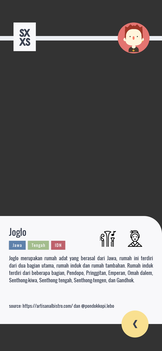

<h1 align="center"> Android Projects </h1>
<h4 align = "center"> <b> Hi, foundation sixty four here. </b> 
<i> Agents, anomalies has been detected in your repo's. </i></h4>

<b>Screenshots of Academica Project</b>

 &emsp;
 &emsp;
 &emsp;

 &emsp;
 &emsp;
 &emsp;
