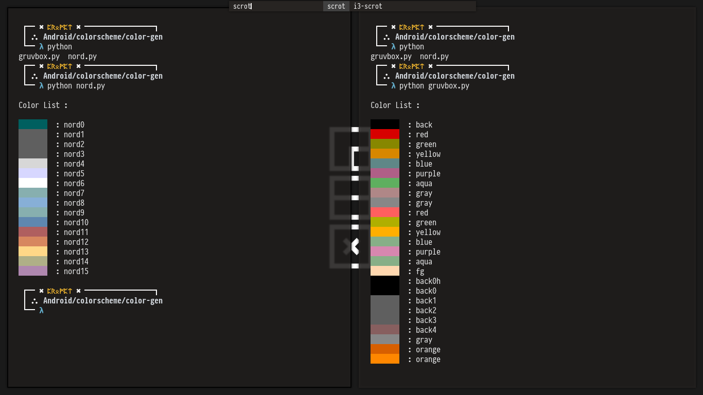

# Color Scheme

This is color scheme that you can add to your android-project,
you might want to change a few lines in this code to your needs.

## Color-scheme In Action [CIA]

Here is some color scheme you can use to spice up your project.

### Nord


## Color Scheme - Gen
You can run python script that I've wrote to see what color it is
in your terminal, files will be saved in `color-gen/colors.py`.
Here you can see some integration of using some of my favourite
color scheme in action.

This is how you generate `colors.py` :

```
$ python3 colors.py
```




## Base 16 ANSI

In using some of this colors, you might be asking why some colors are either
named `color0` or `color8`, it is because some of the color scheme used in
here are used based on 16 ANSI Color, this is based on terminal color scheme, in which old graphic cards only support 16 colors at a time. Since I used terminal more often than not, I'll mostly put colors in this order.

| ANSI    | Color Name | ANSI     | Color Name |
| ------- | ---------- | -------- | ---------- |
| color0  | black      | color8   | grey       |
| color1  | red        | color9   | red        |
| color2  | green      | color10  | green      |
| color3  | yellow     | color11  | yellow     |
| color4  | blue       | color12  | blue       |
| color5  | purple     | color13  | purple     |
| color6  | aqua       | color14  | aqua       |
| color7  | silver     | color15  | white      |


## Nord

Using Nord Theme by Arctic Ice Studio for your android `colors.xml`.

```
<?xml version="1.0" encoding="utf-8"?>
<resources>
    <color name="colorPrimary">#ECEFF4</color>
    <color name="colorPrimaryDark">#2E3440</color>
    <color name="colorAccent">#D08770</color>

    <!--Nord-->
    <!--         Background            -->
    <color name="nord_bgd">#242933</color>
    <color name="nord_bg0">#2E3440</color>
    <color name="nord_bg1">#3B4252</color>
    <color name="nord_bg2">#434C5E</color>
    <color name="nord_bg3">#4C566A</color>
    
    <!--         Foreground            -->
    <color name="nord_fg1">#D8DEE9</color>
    <color name="nord_fg2">#E5E9F0</color>
    <color name="nord_fg3">#ECEFF4</color>
    
    <!--        Shade of Blue           -->
    <color name="nord_aqua">#8FBCBB</color>
    <color name="nord_blue">#5E81AC</color>
    <color name="nord_lblue">#81A1C1</color>
    <color name="nord_sky">#88C0D0</color>
    
    <!--        Aurora Nord             -->
    <color name="nord_red">#BF616A</color>
    <color name="nord_green">#A3BE8C</color>
    <color name="nord_yellow">#EBCB8B</color>
    <color name="nord_purple">#B48EAD</color>
    <color name="nord_orange">#D08770</color>

</resources>
```

## Gruvbox

Using Gruvbox Theme by Pavel Pertsev for your android `colors.xml`.

```
<?xml version="1.0" encoding="utf-8"?>
<resources>
    <color name="colorPrimary">#ECEFF4</color>
    <color name="colorPrimaryDark">#2E3440</color>
    <color name="colorAccent">#D08770</color>

    <!--Gruvbox-->
    <color name="gruvbox_color0">#282828</color>
    <color name="gruvbox_color1">#cc241d</color>
    <color name="gruvbox_color2">#98971a</color>
    <color name="gruvbox_color3">#d79921</color>
    <color name="gruvbox_color4">#458588</color>
    <color name="gruvbox_color5">#b16286</color>
    <color name="gruvbox_color6">#689d6a</color>
    <color name="gruvbox_color7">#a89984</color>
    <color name="gruvbox_color8">#928374</color>
    
    <color name="gruvbox_color9">#fb4934/color>
    <color name="gruvbox_color10">#b8bb26</color>
    <color name="gruvbox_color11">#fabd2f</color>
    <color name="gruvbox_color12">#83a598</color>
    <color name="gruvbox_color13">#d3869b</color>
    <color name="gruvbox_color14">#8ec07c</color>
    <color name="gruvbox_color15">#ebdbb2</color>

```

Source:

- [Arctic Ice Studio ✖ Nord Colorscheme]( https://www.nordtheme.com )
- [Pavel Pertsev ✖ Gruvbox Colorscheme]( https://github.com/morhetz/gruvbox )
