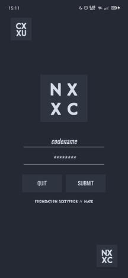

# Color Scheme & Style

Here is my take on color-scheme and styles in android-studio
projects.

# Introduction
for your android-project, sometimes you want easier time to
make some changes into your styles or even color scheme, here
I'll share a bit of OoP you can use while making your project.


## Color Scheme

This is color scheme that you can add to your android-project,
you might want to change a few lines in this code to your needs.

### Color-scheme In Action [CIA]

Here is some color scheme you can use to spice up your project.

#### Nord



### Color Scheme - Gen
You can run python script that I've wrote to see what color it is
in your terminal, files will be saved in `color-gen/colors.py`.
Here you can see some integration of using some of my favourite
color scheme in action.

This is how you generate `colors.py` :

```
$ python3 colors.py
```


### Nord

Using Nord Theme by Arctic Ice Studio for your android `colors.xml`.

```
<?xml version="1.0" encoding="utf-8"?>
<resources>
    <color name="colorPrimary">#ECEFF4</color>
    <color name="colorPrimaryDark">#2E3440</color>
    <color name="colorAccent">#D08770</color>

    <!--Nord-->
    <!--         Background            -->
    <color name="nord_bgd">#242933</color>
    <color name="nord_bg0">#2E3440</color>
    <color name="nord_bg1">#3B4252</color>
    <color name="nord_bg2">#434C5E</color>
    <color name="nord_bg3">#4C566A</color>
    
    <!--         Foreground            -->
    <color name="nord_fg1">#D8DEE9</color>
    <color name="nord_fg2">#E5E9F0</color>
    <color name="nord_fg3">#ECEFF4</color>
    
    <!--        Shade of Blue           -->
    <color name="nord_aqua">#8FBCBB</color>
    <color name="nord_blue">#5E81AC</color>
    <color name="nord_lblue">#81A1C1</color>
    <color name="nord_sky">#88C0D0</color>
    
    <!--        Aurora Nord             -->
    <color name="nord_red">#BF616A</color>
    <color name="nord_green">#A3BE8C</color>
    <color name="nord_yellow">#EBCB8B</color>
    <color name="nord_purple">#B48EAD</color>
    <color name="nord_orange">#D08770</color>

</resources>
```

### Gruvbox

Using Gruvbox Theme by Pavel Pertsev for your android `colors.xml`.

```
<?xml version="1.0" encoding="utf-8"?>
<resources>
    <color name="colorPrimary">#ECEFF4</color>
    <color name="colorPrimaryDark">#2E3440</color>
    <color name="colorAccent">#D08770</color>

    <!--Gruvbox-->
    <color name="gruvbox_color0">#282828</color>
    <color name="gruvbox_color1">#cc241d</color>
    <color name="gruvbox_color2">#98971a</color>
    <color name="gruvbox_color3">#d79921</color>
    <color name="gruvbox_color4">#458588</color>
    <color name="gruvbox_color5">#b16286</color>
    <color name="gruvbox_color6">#689d6a</color>
    <color name="gruvbox_color7">#a89984</color>
    <color name="gruvbox_color8">#928374</color>
    
    <color name="gruvbox_color9">#fb4934/color>
    <color name="gruvbox_color10">#b8bb26</color>
    <color name="gruvbox_color11">#fabd2f</color>
    <color name="gruvbox_color12">#83a598</color>
    <color name="gruvbox_color13">#d3869b</color>
    <color name="gruvbox_color14">#8ec07c</color>
    <color name="gruvbox_color15">#ebdbb2</color>
    
</resources>
```

## Styles

When you change multiple stuff in your android-project,
sometimes it's easier to read few bunch of code rather than
a monolithic style of programming in which you use one file
to introduce everything in your file.

I try making some of this project I make wrapped with `styles.xml` and
`color.xml` so it'll be easier to call objects from other part of the
project into the `activity_main.xml` or any other layout in your file.

So instead of smashing a bunch of code, I use modular approach for my
`styles` and `colors`, each can be opened in this `git` repo's.

I'll separate this code into some sections so it'll be easier to see.

### Default Sections

This part of the code used to deploy your colors and default stuff that
apply to each of your `activities` afterwards, it'll be easier to include
some automation, like changing `background`, `foreground`, `colors`, and
anything that showing in the first line of every `activity` that you
make. You might not see this in your project, but it'll show in the design
that you've made your changes.

```
[styles.xml]

<resources>
    <!-- Base application theme. -->
    <style name="AppTheme" parent="Theme.AppCompat.Light.NoActionBar">
        <!-- Customize your theme here. -->
        <item name="colorPrimary">@color/colorPrimary</item>
        <item name="colorPrimaryDark">@color/colorPrimaryDark</item>
        <item name="colorAccent">@color/colorAccent</item>
        <item name="android:textColor">@color/nord_fg1</item>
        <item name="android:textColorHint">@color/nord_fg3</item>
        <item name="android:fontFamily">@font/osw</item>
        <item name="android:windowTranslucentStatus">false</item>
        <item name="android:windowTranslucentNavigation">true</item>
        <item name="android:background">@color/nord_bgd</item>
        <item name="android:statusBarColor">@color/nord_bgd</item>
    </style>
```

### Button Sections

I add this section into the `button` section, it'll be easier to style your button using this for default, and changing other things inside `activity` for unique stuff

```
[styles.xml]

    <style name="nord_btn" parent="Theme.AppCompat.Light">
        <item name="android:layout_width">0dp</item>
        <item name="android:layout_height">match_parent</item>
        <item name="android:layout_weight">1</item>
        <item name="android:fontFamily">@font/osw</item>
        <item name="android:background">@color/nord_bg0</item>
    </style>
```
To call this into your `activity` you can add `style="@style/nord_cdbtn` into your `button`. your button might look like this code below.

```
[activity_main.xml]

     <Button
         style="@style/nord_btn"
         android:id="@+id/bsubmit"
         android:text="SUBMIT"
         android:layout_marginLeft="5dp"
         />
```

### Bonus Section

This section is for the logo that I use, since I want to make a logo without cluttering insides of the core `main_activity.xml` file, I use
this approach of sending it through the code that I put inside `styles.xml`.

```
[styles.xml]

    <style name="nord_logo" parent="Theme.AppCompat.Light">
        <item name="android:layout_width">400px</item>
        <item name="android:layout_height">400px</item>
        <item name="android:layout_gravity">center_horizontal</item>
        <item name="android:layout_marginBottom">30dp</item>
        <item name="android:elevation">24dp</item>

        <item name="android:text">NX\nXC</item>
        <item name="android:textSize">40dp</item>
        <item name="android:fontFamily">@font/dio</item>
        <item name="android:background">@color/nord_bg0</item>
        <item name="android:letterSpacing">0.5</item>
        <item name="android:lineSpacingMultiplier">1.3</item>
        <item name="android:textStyle">bold</item>
    </style>
</resources>
```
You can add this logo in your `main_activity.xml` with this code:

```
<Button style="@style/nord_logo" />
```
You can use anything you want, but I use `button` just in case I want to add ability to make an `about.xml` layout for the app that I use.

Source:

- [Arctic Ice Studio ✖ Nord Colorscheme]( https://www.nordtheme.com )
- [Pavel Pertsev ✖ Gruvbox Colorscheme]( https://github.com/morhetz/gruvbox )
