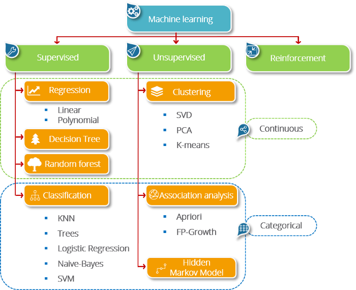

# Machine Learning

There are three categories in Machine Learning :

- Supervised Learning
  - Regression
    - Linear
    - Polynomial
  - Decision Tree
  - Random Forest
  - Classification
    - KNN
    - Trees
    - Logistic Regression
    - Naive Bayes
    - SVM
- Unsupervised Learning
  - Clustering
    - SVD
    - PCA
    - K-means
  - Association Analysis
    - Apriori
    - FP-Growth
  - Hidden Markov Model
- Reinforcement Learning

| Criteria         | Supervised Learning                      | Unsupervised Learning                        | Reinforcement Learning                                |
| ---------------- | ---------------------------------------- | -------------------------------------------- | ----------------------------------------------------- |
| Definition       | Learn using labeled Data                 | Trained without guidance with unlabeled data | Performing actions and learn from errors and rewards  |
| Type of Problems | Regression & Classification              | Association & Clustering                     | Reward Based                                          |
| Type of Data     | Labeled Data                             | Unlabeled Data                               | No Predefined Data                                    |
| Training         | External supervision                     | Unsupervised                                 | Unsupervised                                          |
| Approach         | Maps labeled inputs to the known outputs | Understand Patterns & Discover Output        | Follow trial-and-error method                         |

[Supervised, Unsupervised, and Reinforcement]

source :
- [Difference between Supervised Unsupervised amd reinforcement learning](https://intellipaat.com/blog/wp-content/uploads/2019/12/Difference-between-Supervised-Unsupervised-amd-reinforcement-learning-768x259.jpg)
- [Supervised vs Unsupervised vs Rreinforcementl](https://medium.com/@yunusmuhammad007/2-supervised-vs-unsupervised-vs-reinforcement-ml-dd880c03c1bc)
