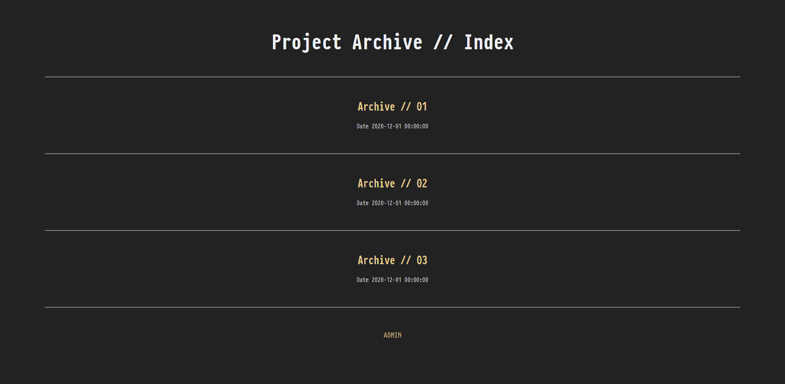
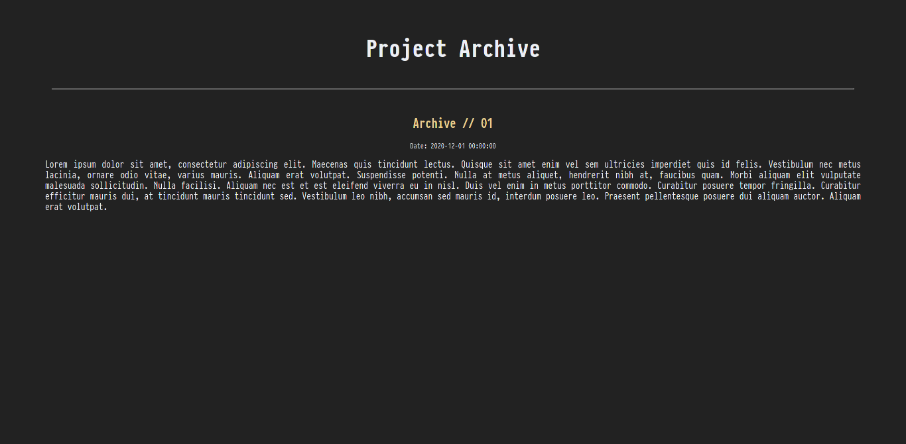
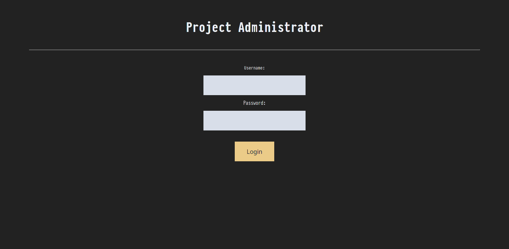
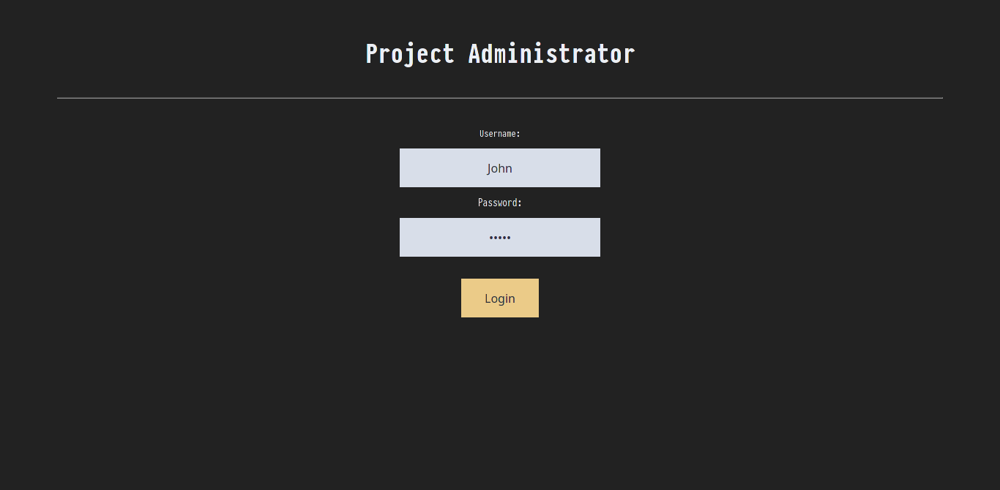
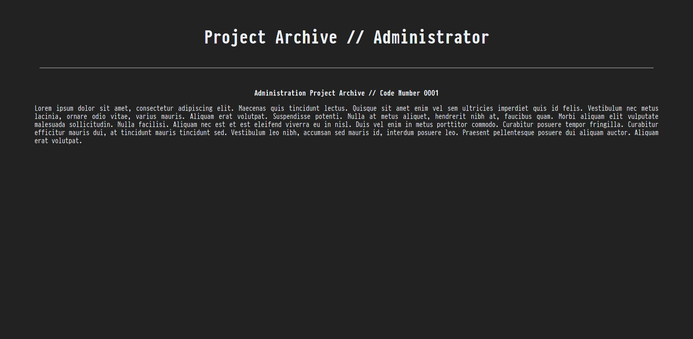
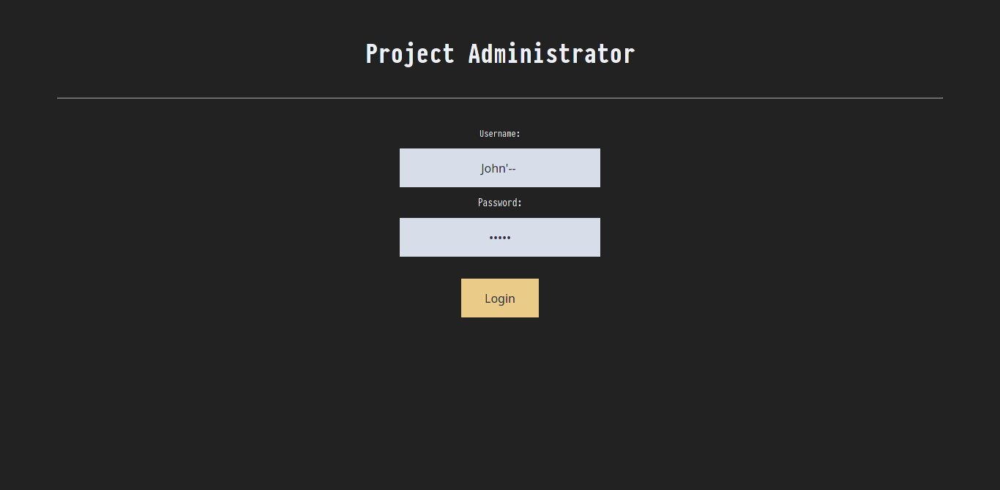

<h1 align="center"> SQL Injection </h1>
<h4 align = "center"> <b> Hi, foundation sixty four here. </b><br>
<i><sup> Agents, anomalies has been detected in your repo's. </sup></i></h4>

# Introduction

[WARNING: WRITER ARE NOT RESPONSIBLE FOR ANY MISUSE OR DAMAGE CAUSED BY USING TOOLS MENTIONED IN THIS REPO. IT IS ILLEGAL TO USE THIS TOOLS WITHOUT MUTUAL CONSENT, YOU'VE BEEN WARNED!]

Sql injection is a type of attack that we use for injecting code into a database, the code can be malicious based on the intended action and results wanted. This type of attack can delete your entire database, let's say you have a database and you didn't use safety regulation that has been provided in the internet (you might have to search for latest security approach that you can implement in your databases code).

To do sql injection, you can use your browser to blind sql injecting or you can use tools like sqlmap to automate injecting the code.

## Installation

This command will be used to install `mysql` and `xampp` in your Arch based distro.
```
$ sudo pacman -S mysql xampp
```

To install `xampp` in Debian based, you can use this command.
```
$ wget https://www.apachefriends.org/xampp-files/5.6.15/xampp-linux-x64-5.6.15-1-installer.run
$ chmod +x xampp-linux-x64-5.6.15-1-installer.run
$ sudo ./xampp-linux-x64-5.6.15-1-installer.run 
```

In Arch based installation, you might be prompted choice, chooose `mariadb`.

This installation will then install `mariadb` to your machine, you can use any `mysql` tools to make database, in here, I'll use cli instead of web version of phpmyadmin since it'll be easier to use, just run the script, and it'll be done.


## SQL Syntax

All the syntax that you have to use can be anything from, `SELECT`, `FROM`, `OR`, `AND`, or any other syntax that usually found inside sql databases.

# Setup Lab

## Create Project Database

In here, I use MariaDB to create databases, you can use mysql instead, it'll be the same process.

This script will autogenerate database from your cli using the sql script that have been provided here, you can download `project_schema.sql` from this repo.

If you want a simple database, you can use this command to generate a lab database, you might want to use `root` as `yourusername`.

```
$ mysql --user="yourusername" -p < /path/to/project_schema.sql
```

This database then will be created by using command above:

```
+----------+------------------+------+-----+---------+----------------+
| Field    | Type             | Null | Key | Default | Extra          |
+----------+------------------+------+-----+---------+----------------+
| id       | int(11) unsigned | NO   | PRI | NULL    | auto_increment |
| username | varchar(30)      | NO   |     | NULL    |                |
| passwd   | varchar(30)      | NO   |     | NULL    |                |
| email    | varchar(40)      | NO   |     | NULL    |                |
+----------+------------------+------+-----+---------+----------------+
```

If you prefer doing it manually, you can go into your database with `sudo mysql` command, you'll prompted with password as `sudo` user.
You can use commands below to create your database.

```
$ sudo mysql


MariaDB [(none)]> show databases;

+--------------------+
| Database           |
+--------------------+
| 1st_database       |
| 2nd_database       |
| 3rd_database       |
+--------------------+
3 rows in set (0.001 sec)

MariaDB [(none)]> create database project;

MariaDB [(none)]> show databases;

+--------------------+
| Database           |
+--------------------+
| Project            |
| 1st_database       |
| 2nd_database       |
| 3rd_database       |
+--------------------+
4 rows in set (0.001 sec)

MariaDB [(none)]> create table user(id int(11) UNSIGNED AUTO_INCREMENT PRIMARY KEY NOT NULL, username VARCHAR (30) NOT NULL, password VARCHAR(30) NOT NULL, email VARCHAR(40) NOT NULL); 

MariaDB [(none)]> CREATE TABLE post (id int(11) AUTO_INCREMENT NOT NULL, title VARCHAR(255) DEFAULT NULL, content TEXT, date_time DATETIME DEFAULT NULL, primary key (id));

MariaDB [project]> show tables;
+-------------------+
| Tables_in_Project |
+-------------------+
| post              |
| user              |
+-------------------+
1 row in set (0.001 sec)

MariaDB [project]> describe user;
+----------+------------------+------+-----+---------+----------------+
| Field    | Type             | Null | Key | Default | Extra          |
+----------+------------------+------+-----+---------+----------------+
| id       | int(11) unsigned | NO   | PRI | NULL    | auto_increment |
| username | varchar(30)      | NO   |     | NULL    |                |
| passwd   | varchar(30)      | NO   |     | NULL    |                |
| email    | varchar(40)      | NO   |     | NULL    |                |
+----------+------------------+------+-----+---------+----------------+
4 rows in set (0.002 sec)

MariaDB [project]> describe post;
+-----------+--------------+------+-----+---------+----------------+
| Field     | Type         | Null | Key | Default | Extra          |
+-----------+--------------+------+-----+---------+----------------+
| id        | int(11)      | NO   | PRI | NULL    | auto_increment |
| title     | varchar(255) | YES  |     | NULL    |                |
| content   | text         | YES  |     | NULL    |                |
| date_time | datetime     | YES  |     | NULL    |                |
+-----------+--------------+------+-----+---------+----------------+
4 rows in set (0.002 sec)
```

## Fixing Mysql

If you're using MariaDB you might want to add this to your MariaDB, `user` is your machine username, and `yourpassword` is password that you want to use as username identifier.

```
MariaDB [none]> use mysql;
MariaDB [mysql]> CREATE USER 'user'@'localhost' IDENTIFIED BY 'yourpassword';
MariaDB [mysql]> exit;
```

For those using Manjaro linux, you might want to see [this post](https://medium.com/@rshrc/mysql-on-manjaro-973e4bfc4f05) to edit help setup your mysql and you'll want to setup password when prompted.

```
$ sudo systemctl start mysqld
$ sudo mysql_install_db --user=mysql --basedir=/usr --datadir=/var/lib/mysql
$ sudo systemctl start mysqld && sudo mysql_secure_installation
```

## Serve PHP

To serve php server, you need to run `sudo xampp start` and also don't forget to put php files inside `htdocs` folder:

```
$ cd /opt/lampp/htdocs/php_files

$ ls

[php_files]
admin_login.php  admin.php  connection.php  index.php  post.php
```

After using this command, your `php_files` will be provided in `https://127.0.0.1/php_files/`.

You'll then see when you access from `https://127.0.0.1/php_files/index.php` this screen below.



You'll be shown simple webpage in which you can interract with, when you click `Archive // 01` you'll be presented with this page. Also you might want to go back to this page again after looking at the post below.



This will be your post page, if you notice, in your address bar, it'll shown like this `http://localhost/php_files/post.php?id=1` take note of this link, it'll be useful later on.

Back to `https://127.0.0.1/php_files/index.php`, you'll see `Admin` at the bottom of the page, click this link, you'll be brought into this page below.




This page will prompt you with a username and password, this will be discussed in the next section of SQL Injection. Pass along, when you insert the right `username` and `password`, then you will see Administrator page.



And if you input wrong `username` and `password` you'll se this page with text below.


## 

# SQL Injection

To actually inject code, you can do it by using `sql` syntaxes, you can see screenshots below for what you can do with `sql` code. You can specify commands inside search bar or automate it with `sqlmap`.

## SQL Query

When creating SQL database and table, you might use `--` to insert comments to your file, this will comment those line and everything that is inserted to that line will be treated as comment.


```
-- -----------------------------------------------------
-- Schema Project
-- -----------------------------------------------------
DROP SCHEMA IF EXISTS Project ;
CREATE DATABASE IF NOT EXISTS Project ;
USE Project ;

```

You can exploit this weakness when you try to login using username 'John', 'Jane', or 'Nyaa' that has been added to the `project_schema.sql`, by using "John'-- ", there's a space, you need to include it inside the login bar, it'll look like this. 

```
VALUES ('1', 'John', 'Lorem', 'johndoe@project.xyz');
VALUES ('2', 'Jane', 'Ipsum', 'janedoe@project.xyz');
VALUES ('3', 'Nyaa', 'Dolor', 'nyaa@project.xyz');
```

This values can be changed in `project_schema.sql` in the section before `Table post`. You can choose username that you want to use to login in the `admin_login.php`

As mentioned above, this time we will use some sql syntax to do code injection, you can use "John'-- " (you need to use ' but not "), you can see in the image shown below.



By using this, you'll introduce escape sequence to your file, this sequence will be executed inside database as:

```
SELECT * FROM user WHERE username = 'John'-- ' AND password ='password'
```

This command will confuse your actual database, because you introduce escape sequence and adding comment behind the query as you can see above, `AND password ='password'` will not be included to the query when you click login, you'll then see `Administrator Page` when you click Login.

There are some other escape sequence that you can use:

```
[John ' OR 1=1 -- ] #only one is needed for statement to be true.

SELECT * FROM user WHERE username = 'John' OR 1=1 -- ' AND password ='password'
```

This escape sequence can be mitigated by adding `/"`[slash] behind your databases query. or `mysqli_real_escape_string` inside your database.


