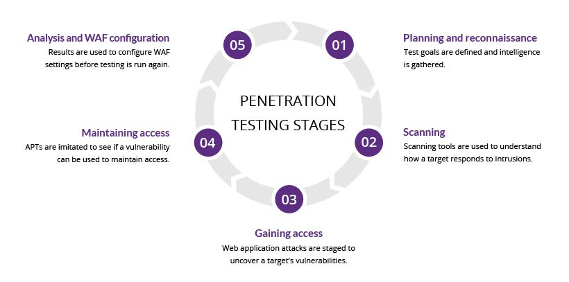

# Basics

In here I'll introduce basics about networking in general.

1. **GNU/Linux**
   - Privilege 
     - Root [#]
     - User [$]
   - File System
     - Filesystem Hierarcy Standard [FHS]
     - Home Directory [~]
   - Command-Line Interface [CLI]
     - Shell
2. **Networking**
   - Penetration Testing
     - Recon phases
     - Privilege Escalation
     - Tools

## GNU/Linux

It is advised to use unix based system to help with understanding
networking in general, since most of networking tools that will be
used here are better to be used with unix based system. 

**GNU** is the interfaces that is used to interract with **Linux** kernel;
some call it **GNU/Linux** but here, I'll be using **UNIX or Linux**
interchangeably to mention **GNU/Linux**.

### Privilege

#### Root [#]

As a root user, you're the system admin or the owner of the machine
that you're on. Basically, you have privilege that can only be
obtained by, knowing the password or by doing hacking. With this
privilege, you can install apps, run scripts that needed root
access, or even changing configuration resided in the system.

#### User [$]

It is you. User doesn't have any privilege to do things as much as
root user do. For instance, you can create, delete, or even changing
files that resides in your home directory without any needs to use
superuser or root privilege. But as you can see, it is limited,
unless you have been added to `sudo` group by root or another `sudo`
group user.


### File System

#### Filesystem Hierarcy Standard [FHS]

Filesystem Hierarcy Standard [FHS] is maintained by Linux Foundation.

| Folder   | Name      | Contents                                           |
| :------- | :-------  | :----------------------------------------------    |
| /bin     | binary    | Software and Commmands used in the system.         |
| /boot    | boot      | Everything that's needed for booting the system.   |
| /dev     | devices   | Device lists, disks, CD-ROM, partition (sda,sda1). |
| /etc     | etcetera  | System specific configuration files.               |
| /home    | home      | Home folder for users in the machine.              |
| /media   | media     | Automatically mounted devices.                     |
| /mnt     | mount     | Manually mounting for devices.                     |
| /opt     | optional  | Optional software that's outside from the system.  |
| /proc    | process   | System processes and sudo files.                   |
| /root    | root      | Home directory for root user.                      |
| /run     | run       | RAM processes will be found here.                  |
| /sbin    | sbinary   | Software used for administering the system(#).     |
| /tmp     | temporary | Temporary copies of the session apps.              |
| /srv     | service   | Server will store files here.                      |
| /sys     | system    | Changing settings here will be temporary           |
| /usr     | user      | External resources under users will be found here. |
| /var     | variable  | All other variables related to sys and session.    |

**source** : https://www.youtube.com/watch?v=HbgzrKJvDRw

#### Home Directory [~]

To show hidden files use `ctrl + h`, you will then see hidden files that
resides here. When you customize your system, you'll se all your configs
here. To navigate your folder, you might need to use `pcmanfm` for your
GUI software.


### Command-Line Interface [CLI]

In unix-based system such as Linux, you might want to accustom yourself
with command line interface. There are some perks using this kind of
approach in managing your system, hence it'll also comes with it's own
pros and cons.

**Pros**

- It's fast to navigate your system once you get accustomed to it.
- Minimum RAM usage and can be opened as much as you want.
- It's known that you can run task faster here, as long as you know
  what to do.
- Customize everything to your heart's content.

**Cons**

- Hard to use if you're here for the first time.
- No fancy animations you get from GUI application.
- Actually you can do it; *if you have time to spare.*


#### Shell

Bash is Bourne Again SHell is a language used for processing or
running commands in the command-line interface. Bash, ZSH, Fish or
any other flavour of Shell [sh] is using most of syntaxes
that Bash is using.

Flavour that is introduced in Linux based system are mostly to make
configuration that is tailored to your taste rather than one-size-fits-all
solutions.

#### Commands

| Command  | Name                   | Usage             | Options |
| :------- | :--------------------- | :---------------- | ------: |
| cd       | Change Directory       | cd /home/username |         |
| pwd      | Path to current folder | pwd               |         |
| ls       | List Directory         | ls /home/username | -lash   |
| clear    | Clear Terminal         | clear             |         |
| rm       | Remove files or dirs   | rm anomaly.txt    | -rf     |
|          |                        |                   |         |


Sometimes, using all these syntaxes can be easier if it's made as a shortcut
rather than by itself, that way you can make your own script that use all
these command in tandem. One solution for this might be `.bash_aliases`;
this file contain `aliases`, that can be used in the same way as making
shortcuts.

## Distros or DE?

Distribution manage all your packages. You might want to use Debian based distros if you're new to linux.

| Base   | Package Manager | Usage           |
| :----  | :-------------: | --------------: |
| Arch   | package-manager | pacman -Syyu    |
| Debian | aptitutde       | apt-get install |
| Fedora | Dandified YUM   | dnf install     |

There are tailored distros that are based on above mainline ditros, they might
be tailored for specified category in mind, like gaming, studio, and so on.

| Flavour       | Tailored For         |
| :-----        | -----------:         |
| PopOS!        | Gaming               |
| PeppermintOS  | Reviving old laptops |
| RedHat        | Servers              |
| Ubuntu Studio | Studio               |
| Kali Linux    | Network & Hacking    |

Desktop Enviornment or Desktop interfaces is the graphical interface that
you'll be interacting with.

| Desktop Environment | Best Distro     |
| :------------------ | :-------------: |
| GNOME               | PopOS! / Ubuntu |
| KDE Plasma          | Kubuntu         |
| Xfce                | Manjaro / Mint  |
| Deepin Desktop      | UbuntuDDE       |
| Budgie              | Solus           |
| Cinnamon            | Mint            |
| Pantheon            | Elementary OS   |
| MATE                | Ubuntu          |
| LXDE/LXQt           | PeppermintOS    |


**Youtube Sources :**
- [Infinitely Galactic](https://www.youtube.com/user/InfinitelyGalactic)
- [Chris Titus Tech](https://www.youtube.com/user/homergfunk)

# Networking

1. eth0 vs wlan0

| Device             | IP Adress       |
| :----------------- | --------------: |
| Router IP Address  | 192.168.1.0/24  |
| Localhost          | 127.0.0.1/24    |


# Penetration Testing

There are 5 phases that you might want to see before doing any kind of 
hacking, this will be your core principle to do *Red or Blue Teaming*
once you understand this 5 phases.



To start, it's easier to use distro that is tailored specifically for 
Offensive Security & Defensive security. Distros that are specifically
used for hacking are already installed with bunch of tools that can be
used for Red or Blue Teaming alike.

Word of Caution! Please don't use these distros as your mainly driver if
you don't know what you're doing, since usage of this without any monitoring
might lead to vulnerabilites in your system. Also these distros are advised 
to be used inside a vmbox or live cd's as per their nature of offensive part
of networking distros. You've been warned.

| Flavour    | Tailored For       | Links                                |
| :--------- | :----------------- | :----------------------------------- |
| Kali Linux | Hacking            | https://www.kali.org/downloads/      |
| Parrot OS  | Security & Privacy | https://www.parrotsec.org/download/  |
| Black Arch | Network & Hacking  | https://blackarch.org/downloads.html |

Although it is advised to use this distros for built in out-of-the-box tools,
as long as you know how to search for packages and repos, it's possible to
just use any mainline based distros to just add repos for each respective
distros and use it, it's not advised but possible.

```
$ ifconfig
```


```

lo: flags=##<UP,LOOPBACK,RUNNING>  mtu ######
        inet 127.0.0.1  netmask 255.0.0.0

wlp1s0: flags=##<UP,BROADCAST,RUNNING,MULTICAST>  mtu ######
        inet 192.168.1.XX  netmask 255.255.255.0  broadcast 192.168.1.255
        
```


Physical vs Over the Network
