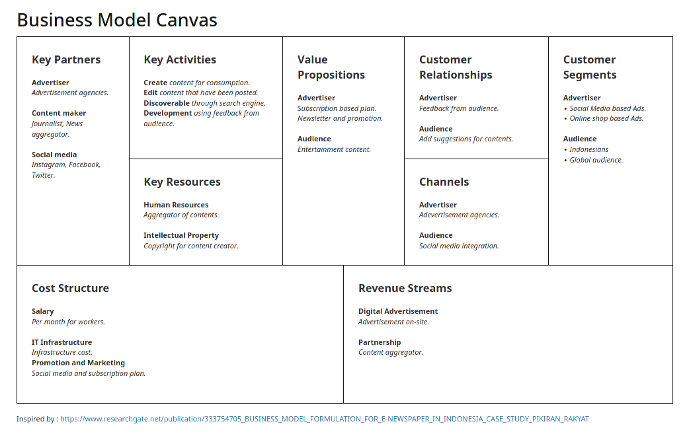

{width=110%}

\newpage

# Business Model

- **Digitization**
  
  By digitazing news, it's easier for people to access actual and factual based news.

- **Hidden Revenue**
  
  Advertisement (High-end, not low end), or minimum amount of non-intrusive ads will help income from sponsored articles.

- **Leverage Customer Data**

  Data gathered anonymously for demographic and light targeted ads, hence advertisement will be build as non-intrusive as possible.

- **Subscription**

  Regular fee by subscription will help audience to get vip contents like tutorial or user-made contents.

- **Open Business Model**

  Collaboration with collaborators will help ensure a good amount of content produced, this will help with traffics.

